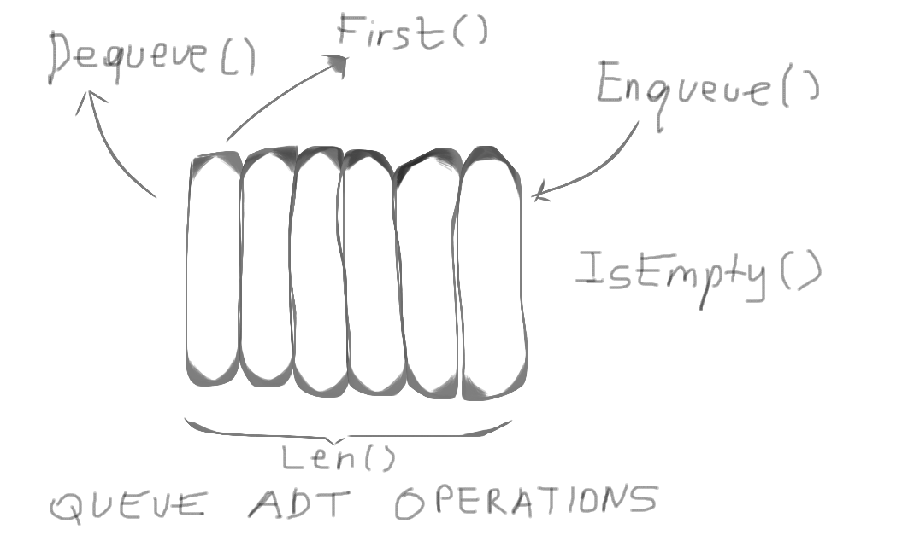

# Golang


---------------------------------------------------------------------

# Queues

* Queues are one of the fundamental data structures in computer science.
* They are linear data structures.
* Working principle of stacks is FIFO (First in first out).

* ADT (Abstract Data Type) operations of queues are:
* 1. Enqueue()
* 2. Dequeue()
* 3. Len()
* 4. IsEmpty()
* 5. First()
----------------------------------------------------------
## Time complexities of ADT operations

| **Operation** | **Complexity** |
| ------------- | -------------- |
| Q.Enqueue(e)  | O(1)*          |
| Q.Dequeue()   | O(1)*          |
| Q.First()     | O(1)           |
| Q.IsEmpty()   | O(1)           |
| Q.Len()       | O(1)           |

* Why Enqueue and Dequeue operations are **amortized**?
* Because, these operations can cause reallocation (extension or shrinkage) on slices.




------------------------------------------------------------

## Example usage

```go
// Create a new Queue.
Q := new(Queue)
fmt.Println("empty? ", Q.IsEmpty())
	
// Enqueue items
Q.Enqueue("cat")
Q.Enqueue(1999)
Q.Enqueue("car")
Q.Enqueue(11.111)
Q.Enqueue(true)
	
// Print
fmt.Println(Q.Show())
fmt.Println("len(Q) ", Q.Len())
fmt.Println("dequeue ", Q.Dequeue())
fmt.Println("dequeue ", Q.Dequeue())
fmt.Println(Q.Show())
fmt.Println("len(Q) ", Q.Len())
fmt.Println("first ", Q.First())
fmt.Println("empty? ", Q.IsEmpty())
```

```[console]
empty?  true
[cat 1999 car 11.111 true]
len(Q)  5
dequeue  cat
dequeue  1999
[car 11.111 true]
len(Q)  3
first  car
empty?  false
```
--------------------------------------------------

## Implementation

* In implementation, slice is used to store data.
* As the type that are going to store in queue structure, **interface** is used.
* All of the ADT operations are implemented. Moreover, **Show()** function is explemented as an extra to show whole data stored in queue.
* In order to overcome data errors, **sync.Mutex** is used to applying functions concurrently.
* Whole code implementation can be seen in **Queues/Queues.go**.
------------------------------------------------------

## Licence

MIT
